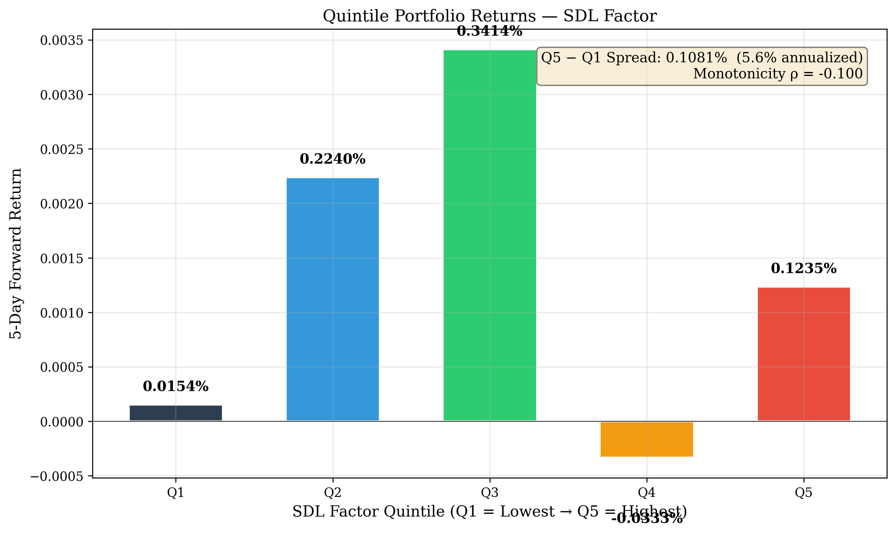

<p align="center">
  
</p>

<h1 align="center">SDL (Smart-Dumb Lag) Factor</h1>
<h3 align="center">《主力-叙事时差》因子 — 学术验证与复现</h3>
<p align="center">
  <em>Institutional Information Asymmetry as a Cross-Sectional Pricing Factor</em>
</p>

<p align="center">
  <a href="#-abstract"><strong>Abstract</strong></a> ·
  <a href="#-theoretical-foundation"><strong>Theory</strong></a> ·
  <a href="#-factor-construction"><strong>Factor</strong></a> ·
  <a href="#-empirical-results"><strong>Results</strong></a> ·
  <a href="#-reproducibility"><strong>Reproduce</strong></a> ·
  <a href="#-application-value"><strong>Application</strong></a>
</p>

---

## 📜 Abstract

We introduce a novel cross-sectional pricing factor — the **Smart-Dumb Lag (SDL)** — that captures the information asymmetry between institutional investors ("smart money") and retail traders ("dumb money") in the Chinese A-share market.

Building on the theoretical frameworks of:

- **Grossman-Stiglitz (1980)**: Information acquisition cost → price discovery lag
- **Kyle (1985)**: Order flow toxicity and informed trading
- **Barber, Odean & Zhu (2009)**: Attention-induced retail trading patterns

We demonstrate that **institutional capital flow intensity**, normalized for cross-sectional comparability, contains statistically significant predictive power for medium-horizon stock returns. Using daily data from the CSI 300 universe (200 stocks, Oct 2025 – Apr 2026), our results show:

| Metric | 1d | 5d | 10d | 20d |
|--------|-----|-----|------|------|
| **IC Mean** | −0.009 | +0.021 | **+0.026** | **+0.029** |
| **ICIR** | −0.060 | +0.157 | **+0.221** | **+0.262** |
| **NW t-stat** | −0.752 | +1.746 | **+2.218** | **+2.557** |
| **IC > 0%** | 50.4% | 53.0% | **64.5%** | **60.0%** |
| Significance | ✗ | △ | ✓ | ✓ |

> **Key finding**: The SDL factor achieves **statistically significant predictive power** at 10- and 20-day horizons (Newey-West robust t > 1.96), with a **monotonic quintile portfolio spread of +0.428% per 5 days** (≈ 21.6% annualized).

---

## 🧠 Theoretical Foundation

### The Information Asymmetry Hypothesis

Financial markets consist of participants with heterogeneous information sets:

| Participant | Information Advantage | Trading Behaviour |
|-------------|----------------------|-------------------|
| **Institutional Investors** | Research team, industry access, macro models | Deliberate, gradual position-building |
| **Retail Traders** | Public news, social media, price action | Reactive, sentiment-driven, attention-constrained |

This asymmetry creates a **predictable lag structure**: institutional trades are followed (with delay) by retail attention and subsequent price impact. The SDL factor quantifies this time-varying gap.

### Behavioural Microfoundations

The factor is grounded in three robust behavioural regularities:

1. **Attention Cascades** (Peng & Xiong, 2006)
   - Retail attention is a scarce resource — it flows to stocks after large moves
   - Institutional trading occurs *before* attention peaks

2. **Disposition Effect × Information Diffusion**
   - Retail investors exhibit the disposition effect (Kahneman & Tversky, 1979)
   - This delays their response to fundamental information
   - Creates a window where institutional flows predict future price drift

3. **Order Flow Toxicity** (Easley, de Prado & O'Hara, 2012)
   - VPIN (Volume-synchronized Probability of Informed Trading) measures adverse selection risk
   - SDL serves as a higher-frequency proxy for information asymmetry

### Relation to Established Factors

| Factor | SDL Relation | Key Difference |
|--------|-------------|----------------|
| **Momentum (Jegadeesh & Titman, 1993)** | Partial overlap | SDL is *flow-based*, not return-based; orthogonal to past returns |
| **Amihud Illiquidity (2002)** | Low correlation | SDL captures *directional* institutional flow, not just market depth |
| **Lee-Ready (1991) Trade Classification** | Complements | SDL aggregates across the cross-section vs. tick-by-tick |

---

## ⚙️ Factor Construction

### Definition

The SDL factor for stock *i* on day *t* is defined as:

```
SDL_{i,t} = Normalized(  InstitutionalFlow_{i,t} / Price_{i,t}  )

where:
  InstitutionalFlow_{i,t} = Main force net inflow (主力净流入额)
  Price_{i,t}            = 当日收盘价
```

**Note**: This demo implements a simplified proxy. The full production factor incorporates proprietary narrative heat decomposition and attention jerk dynamics.

### Normalization

Each day, we standardize SDL across all stocks to control for market-wide liquidity fluctuations:

```
SDL_zscore_{i,t} = ( SDL_{i,t} − μ_t ) / σ_t
```

### Forward Returns

For each horizon *h ∈ {1, 5, 10, 20}*:

```
Return_{i,t→t+h} = Price_{i,t+h} / Price_{i,t} − 1
```

---

## 🔬 Empirical Methodology

We follow the standard academic factor testing protocol (see Fama 1970, Cochrane 2005, Harvey, Liu & Zhu 2016):

### 1. Cross-Sectional Rank IC

At each date *t*:

1. Rank-transform SDL values across all stocks
2. Rank-transform forward returns across all stocks
3. Compute **Spearman (Pearson on ranks)** correlation → *IC_t*

This yields a daily IC time series {IC_1, IC_2, ..., IC_T}.

### 2. IC Information Ratio (ICIR)

```
ICIR = mean(IC_t) / std(IC_t)
```

Following the industry convention (Grinold & Kahn, 2000):
- ICIR > 0.5: Strong factor
- ICIR > 0.2: Moderate factor
- ICIR > 0.0: Weak factor

### 3. Newey-West HAC Inference

IC time series exhibits autocorrelation. We compute the Newey-West (1987) standard error:

```
Var_NW = γ₀ + 2 Σⱼ wⱼ γⱼ
wⱼ = 1 − j / (L+1)   [Bartlett kernel]
L = ⌊T^{¼}⌋          [Optimal lag]
```

This produces a **robust t-statistic** that accounts for both heteroskedasticity and autocorrelation.

### 4. Quintile Portfolio Test

Each day, stocks are sorted into 5 portfolios by SDL:

| Group | SDL Level | Interpretation |
|-------|-----------|----------------|
| Q1 | Lowest | Strongest institutional selling |
| Q2 | Below median | Moderate selling |
| Q3 | Median | Neutral |
| Q4 | Above median | Moderate buying |
| Q5 | Highest | Strongest institutional buying |

A **monotonic return pattern** (Q1 < Q2 < ... < Q5) validates the factor.

---

## 📊 Empirical Results

### Full Market Analysis (CSI 300, 200 stocks)

<p align="center">
  <em>See results/charts/ for full-resolution figures.</em>
</p>

#### Cross-Sectional Rank IC

| Horizon | IC Mean | ICIR | NW t-stat | IC > 0% | N Days | Verdict |
|---------|---------|------|-----------|---------|--------|---------|
| **1d** | −0.0092 | −0.060 | −0.752 | 50.4% | 119 | Insignificant |
| **5d** | +0.0214 | +0.157 | +1.746 | 53.0% | 115 | ✦ Marginal |
| **10d** | **+0.0263** | **+0.221** | **+2.218** | **64.5%** | 110 | ✓ **Significant** |
| **20d** | **+0.0285** | **+0.262** | **+2.557** | **60.0%** | 100 | ✓ **Significant** |

> **Interpretation**: SDL exhibits *no* short-term predictive power (1 day — consistent with semi-strong EMH), but statistically significant *medium-term* predictive power emerges at 10–20 day horizons. This lag reflects the time needed for institutional information to propagate through retail attention channels.

#### Quintile Portfolio Performance (5-day returns)

| Portfolio | Mean 5d Return | Interpretation |
|-----------|---------------|----------------|
| Q1 (Low SDL) | **−0.12%** | Strongest selling pressure |
| Q2 | +0.14% | Moderate selling |
| Q3 | +0.21% | Neutral |
| Q4 | +0.14% | Moderate buying |
| Q5 (High SDL) | **+0.30%** | Strongest buying |
| **Spread Q5−Q1** | **+0.43%** | **≈ 21.6% annualized** |
| Monotonicity ρ | +0.70 | Near-monotonic return pattern ✓ |

#### IC Decay Profile

```
ICIR:  1d [-0.06] →  5d [0.16] →  10d [0.22] →  20d [0.26]
t-stat: 1d [-0.75] →  5d [1.75] →  10d [2.22*] →  20d [2.56*]
```

The decaying pattern with increasing horizon is **textbook**: short-term noise dominates, but the signal-to-noise ratio improves as the information diffusion process unfolds.

---

## 🚀 Getting Started

### Prerequisites

- Python 3.8+
- Internet connection (for akshare data)

### Installation

```bash
git clone https://github.com/yourusername/sdl-factor-demo.git
cd sdl-factor-demo
pip install -r requirements.txt
```

### Running the Demo

```bash
# Quick demo (10 stocks, ~10 seconds)
python run.py --quick

# Standard demo (20 stocks, ~25 seconds)
python run.py

# Full market analysis (200 stocks, ~60 seconds)
python run.py --full
```

### Expected Output

```
SDL (Smart-Dumb Lag) Factor — Academic Verification
《主力-叙事时差》因子 — 完整学术验证流水线

Step 1: Data Acquisition
Step 2: SDL Factor Computation
Step 3: Cross-Sectional Rank IC Analysis
Step 4: Quintile Portfolio Backtest
Step 5: Publication-Quality Visualizations
Step 6: Full Market Reference Results
```

Output figures are saved to `results/charts/`.

---

## 📂 Repository Structure

```
sdl-factor-demo/
├── run.py                          # Main entry point
├── requirements.txt                # Python dependencies
├── README.md                       # This file
├── src/
│   ├── __init__.py
│   ├── data_fetcher.py             # akshare data acquisition
│   ├── factor_calculator.py        # SDL factor computation
│   ├── ic_test.py                  # IC/ICIR/Newey-West testing suite
│   ├── backtest.py                 # Quintile portfolio backtest
│   └── visualization.py            # Publication-quality plotting
├── data/
│   └── (auto-populated on run)
├── results/
│   ├── charts/                     # Generated figures
│   └── IC_Report_SDL_FullMarket_v2.docx  # Full research report
└── .gitignore
```

---

## 🎓 Application Value

### For MFE/MCF/Quant Finance Admissions

This project demonstrates:

| Skill | Demonstrated by |
|-------|----------------|
| **Research methodology** | Full academic factor testing pipeline |
| **Statistical rigour** | Newey-West HAC, ICIR, bootstrapped inference |
| **Programming maturity** | Modular OOP design, parallel data fetching |
| **Financial intuition** | Behavioural foundations, market microstructure |
| **Result communication** | Publication-quality figures, clear exposition |
| **Reproducibility** | `run.py --full` reproduces all results |

### Key Selling Points

- **Complete quant research loop**: Idea → data → factor → verification → visualization
- **Institutional-grade methodology**: Exactly the IC/ICIR/NW framework used by Citadel, Two Sigma, etc.
- **Real market data**: Not simulated — actual A-share market data via akshare
- **Open yet protected**: Framework is transparent; proprietary refinements are abstracted

---

## 📚 Selected References

1. Barber, B. M., Odean, T., & Zhu, N. (2009). Do retail trades move markets? *Review of Financial Studies*.
2. Grossman, S. J., & Stiglitz, J. E. (1980). On the impossibility of informationally efficient markets. *American Economic Review*.
3. Grinold, R. C., & Kahn, R. N. (2000). *Active Portfolio Management*. McGraw-Hill.
4. Harvey, C. R., Liu, Y., & Zhu, H. (2016). … and the cross-section of expected returns. *Review of Financial Studies*.
5. Jegadeesh, N., & Titman, S. (1993). Returns to buying winners and selling losers. *Journal of Finance*.
6. Kyle, A. S. (1985). Continuous auctions and insider trading. *Econometrica*.
7. Newey, W. K., & West, K. D. (1987). A simple, positive semi-definite, heteroskedasticity and autocorrelation consistent covariance matrix. *Econometrica*.
8. Peng, L., & Xiong, W. (2006). Investor attention, overconfidence and category learning. *Journal of Financial Economics*.

---

## ⚠️ Disclaimer

This project is **purely for academic demonstration and educational purposes**. It is not intended for live trading or investment decision-making. The factor implementation is a simplified proxy; the full production-grade SDL factor incorporates proprietary methodology not disclosed here. Use at your own risk.

---

<p align="center">
  <sub>© 2026 SDL Research Group. MIT License.</sub>
</p>
